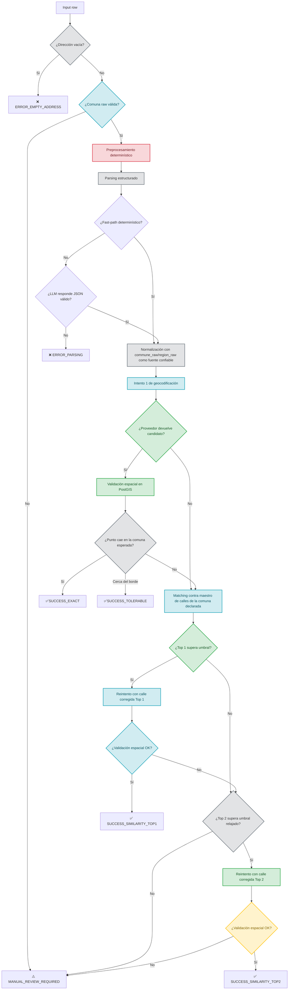

# Geo-LLM

Sistema de geocodificación asistido por LLM para direcciones en Chile. El proyecto combina preprocesamiento determinístico, parsing estructurado, geocodificación, validación espacial en PostGIS, recuperación por similitud contra maestro de calles y una consola operacional tipo Mission Control para ejecutar y monitorear batches.

## Estado actual

El proyecto ya no usa Streamlit como interfaz principal. La UI operativa actual es:

- Frontend: React servido por FastAPI
- Backend: FastAPI
- Monitoreo en tiempo real: WebSocket
- Validación espacial: PostgreSQL + PostGIS
- Parser LLM local: Ollama
- Proveedor por defecto del pipeline real: `PostGIS local`

La aplicación principal vive en `http://127.0.0.1:8000/mission-control`.

## Cómo lanzar la aplicación

### 1. Requisitos

- Python 3.9+
- PostgreSQL con PostGIS y tablas del proyecto cargadas
- Ollama corriendo localmente
- Dependencias instaladas en `.venv`

### 2. Crear y activar entorno virtual

```bash
python3 -m venv .venv
source .venv/bin/activate
pip install -r requirements.txt
```

### 3. Configuración base

La configuración se lee desde `.env` mediante `core/settings.py`. Variables relevantes:

```env
POSTGRES_HOST=localhost
POSTGRES_PORT=5432
POSTGRES_DB=geo_db
POSTGRES_USER=postgres
POSTGRES_PASSWORD=postgres

OLLAMA_BASE_URL=http://localhost:11434
OLLAMA_MODEL=gemma3n:latest
OLLAMA_TIMEOUT_S=45

NOMINATIM_BASE_URL=https://nominatim.openstreetmap.org/search

DEFAULT_GEOCODER_PROVIDER=postgis
BATCH_MAX_WORKERS=4
BATCH_CHUNK_SIZE=8
SIMILARITY_MATCH_THRESHOLD=0.8
MAX_RETRIES=3
```

Notas:

- `DEFAULT_GEOCODER_PROVIDER=postgis` deja `PostGIS local` como motor por defecto.
- `NOMINATIM_BASE_URL` se usa sólo si se selecciona `nominatim` o `hybrid`.
- Si se quiere Nominatim local, se debe apuntar explícitamente esa variable a la instancia local.

### 4. Levantar la API y Mission Control

```bash
.venv/bin/uvicorn api.main:app --host 127.0.0.1 --port 8000
```

Rutas principales:

- App: `http://127.0.0.1:8000/mission-control`
- Swagger: `http://127.0.0.1:8000/docs`
- Health: `http://127.0.0.1:8000/health`

## Arquitectura actual

- `core/`: pipeline real, parser, normalización, geocodificación, validación espacial y matching
- `api/routers/batches.py`: upload, corrida por batch y resultados
- `api/routers/mission_control.py`: control operacional, stream, métricas, exportación y mapa
- `api/main.py`: entrada FastAPI y publicación del frontend
- `frontend/`: Mission Control React servido como assets estáticos

## Mission Control

La interfaz actual permite:

- subir CSV/XLSX
- seleccionar columna ID, dirección, comuna y región
- configurar parser, proveedor y parámetros del pipeline
- iniciar, pausar, reanudar y cancelar batches
- monitorear progreso en tiempo real
- visualizar puntos validados espacialmente
- exportar resultados, errores y logs

Importante:

- `Crear demo batch` sigue siendo una sesión simulada para revisar la UI
- `Subir archivo` + `Iniciar batch` ejecuta el pipeline real contra la base de datos

## Flujo de decisiones del orquestador

El flujo vigente de `core/orchestrator.py` para cada dirección es este:



## Cambios funcionales relevantes ya incorporados

### Pipeline y decisiones

- `commune_raw` y `region_raw` se tratan como información de alta confianza
- el matching de calles se hace dentro de la comuna declarada
- la validación espacial se contrasta contra la comuna esperada
- direcciones vacías terminan en `ERROR_EMPTY_ADDRESS`
- comunas inválidas como `#N/D`, `N/D`, `null` o vacías pasan a revisión manual

### Performance

- el pipeline real corre con concurrencia controlada por lotes pequeños
- defaults actuales:
  - `BATCH_MAX_WORKERS=4`
  - `BATCH_CHUNK_SIZE=8`
- se redujo ruido en eventos del batch
- el parser tiene fast-path determinístico para casos simples antes de llamar a Ollama
- `OLLAMA_TIMEOUT_S` quedó configurable y más tolerante

### Geocodificación

- proveedor por defecto: `postgis`
- proveedores soportados:
  - `postgis`
  - `nominatim`
  - `hybrid`
- `hybrid` intenta `PostGIS local` y cae a `Nominatim` sólo si no encuentra resultados
- el geocoder local tiene degradación si falla `similarity()` o no está disponible `pg_trgm`

### Validación espacial

- se corrigió el cruce de SRID para comparar punto y polígono en el mismo sistema de referencia
- se persisten `expected_commune`, `expected_region`, `result_commune`, `result_region`

### Mission Control

- la UI real quedó integrada a FastAPI
- `Mission Control` consume snapshots reales del batch desde BD
- el stream en tiempo real usa WebSocket
- el mapa base soporta:
  - `CartoDB.Positron`
  - `CartoDB.DarkMatter`
  - `OpenStreetMap`
  - `Esri.WorldImagery`
  - `OpenTopoMap`

### Exportación

El export de resultados incluye trazabilidad útil para auditoría:

- `source_id`
- `address_id`
- `address_raw`
- `commune_raw`
- `region_raw`
- `commune_match`
- `region_match`
- `address_queried`
- `address_corrected`
- `geocoding_status`
- `lat`
- `lon`

## Endpoints principales

### Batch y ejecución

- `POST /api/v1/batches/upload`
- `POST /api/v1/batches/{batch_id}/run`
- `POST /api/v1/batches/{batch_id}/configure`
- `POST /api/v1/batches/{batch_id}/start`
- `POST /api/v1/batches/{batch_id}/pause`
- `POST /api/v1/batches/{batch_id}/resume`
- `POST /api/v1/batches/{batch_id}/cancel`

### Monitoreo

- `GET /api/v1/batches/{batch_id}/summary`
- `GET /api/v1/batches/{batch_id}/events`
- `GET /api/v1/batches/{batch_id}/metrics`
- `GET /api/v1/batches/{batch_id}/map-points`
- `WS /api/v1/batches/{batch_id}/stream`

### Resultados

- `GET /api/v1/batches/{batch_id}/results`
- `GET /api/v1/batches/{batch_id}/export?dataset=results`
- `GET /api/v1/batches/{batch_id}/export?dataset=errors`
- `GET /api/v1/batches/{batch_id}/export?dataset=logs`

## Tests

Tests principales:

```bash
PYTHONPATH=. .venv/bin/pytest
```

Validación rápida de sintaxis:

```bash
python3 -m py_compile core/settings.py core/llm_parser.py core/geocoding.py core/orchestrator.py core/spatial_validation.py api/routers/mission_control.py api/routers/batches.py api/mission_control.py
```

## Limitaciones actuales

- `PostGIS local` hoy resuelve a nivel de tramo/calle y no hace interpolación fina por numeración
- el pipeline real todavía no es distribuido; usa concurrencia local con `ThreadPoolExecutor`
- muchos casos complejos aún dependen del LLM
- el batch real y el demo batch comparten UI, pero no el mismo origen de datos

## Siguientes pasos razonables

- interpolación por numeración sobre red vial o maestro enriquecido
- health panel de servicios en Mission Control (`PostGIS`, `Ollama`, `Nominatim`)
- clustering real de puntos en mapa para batches grandes
- paralelización más agresiva o separación del geocoder como servicio dedicado
- evaluar implementación en Rust sólo si el cuello de botella pasa a ser CPU/IO del geocoder local y no latencia de LLM o cobertura del maestro
